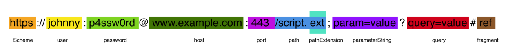
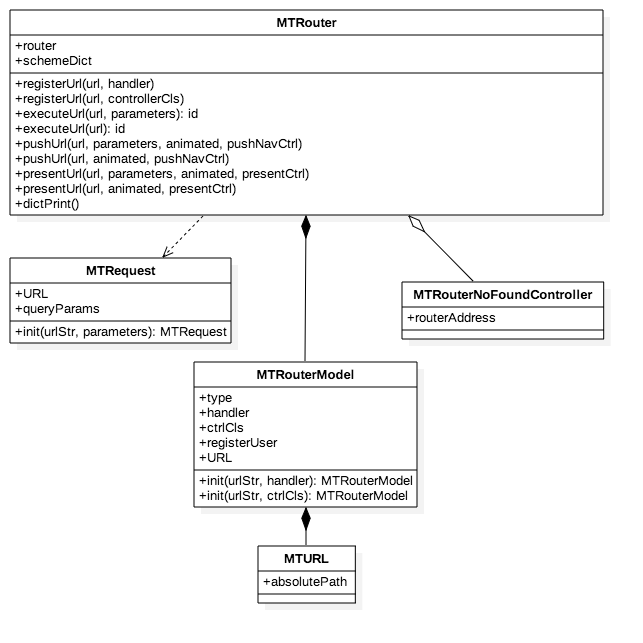

MTRouter
-------
## 目录
* [简述](#简述)
* [设计结构](#设计结构)
	* [NSURLComponent介绍](#NSURLComponent介绍)
	* [路由对象存储设计方案](#路由对象存储设计方案)
	* [类图结构](#类图结构)
	* [补充](#补充)
* [使用方式](#使用方式)
* [路由性能评测](#路由性能评测)
* [未来优化](#未来优化)
* [结语](#结语)

## 简述
组件化路由的设计方案，用于组件化各业务模块的解耦

> 功能：

* 直接配置Controller，实现Controller的创建，push，present
* 配置Handler，用户模块个性化配置、对已有Controller实例参数传递

## 设计结构
### NSURLComponent介绍
首先来熟悉一下NSURLComponent的各个字段：


### 路由对象存储设计方案
```objc
{
    module1 =     {
        firstCtrl = "type: MTRouterModelTypeController, ctrlCls: FirstViewController";
        moduleInit = "type: MTRouterModelTypeHandler";
        secondCtrl = "type: MTRouterModelTypeController, ctrlCls: SecondViewController";
    };
    module2 =     {
        firstCtrl/ttt = "type: MTRouterModelTypeController, ctrlCls: FirstViewController";
        moduleInit = "type: MTRouterModelTypeHandler";
        secondCtrl/abc = "type: MTRouterModelTypeController, ctrlCls: SecondViewController";
    };
}
```

* 分为两层的 `dictionary` ，第一层Key为 `Scheme` ，第二层Key为 `host+path` ， 存放 `MTRouterModel` 对象
* 传参只能通过 `query` 和 `parameters` ，舍弃了 `module//ctrl/:id` 的传递方式，提高查询效率

### 类图结构


> `MTRouter`

* 用于路由注册
* `registerUrl:handler:` 注册一个路由，触发handler事件，通常来说用于模块初始化设置，模块Controller实例之间参数传递, 不建议乱用
* `registerUrl:controllerCls:` 注册一个controller的路由
* `executeUrl:parameters:` 、 `executeUrl:` 触发一个路由,当是Controller的路由时，会返回Controller
* `pushUrl:parameters:animated:pushNavCtrl:` 、`pushUrl:animated:pushNavCtrl:` push出url对应的Controller
* `presentUrl:parameters:animated:presentCtrl:` 、 `presentUrl:animated:presentCtrl:` present出url对应的Controller
* `dictPrint` 打印存储结构

> `MTRequest`

* 自定义request对象，用于触发路由时，解析url

> `MTURL`

* `NSURL` 的扩展，添加了 `absolutePath` 为 `host+path`

> `MTRouterNoFoundController`

* 当找不到路由对应的Controller时，返回此类，提示开发者路由未找到

### 补充

1.当url不存在时，返回MTRouterNoFoundController的实例。

2.当url已经注册时，通过 `NSAssert` 抛出异常

## 使用方式

1. pod导入

```ruby
    pod 'MTTheme'
```
2. 路由注册
大家可以将路由注册写在 `+load` 中， 这样在 `pre-main` 时就会自动注册路由

```objc
    // controller路由注册
    [MTRouter.router registerUrl:@"module://firstCtrl" controllerCls:FirstViewController.class];
    [MTRouter.router registerUrl:@"module://secondCtrl" controllerCls:SecondViewController.class];
    
    //模块个性化路由注册
    [MTRouter.router registerUrl:@"module://moduleInit#user" handler:^id(NSDictionary *parameters) {
        Initialization *initObj = Initialization.initObj;
        initObj.firstCtrlBackgroundColor = parameters[@"firstCtrlBackgroundColor"];
        initObj.secondCtrlBackgroundColor = parameters[@"secondCtrlBackgroundColor"];
        return nil;
    }];
```

3. 路由使用

```objc
	// controller路由的使用
	[MTRouter.router pushUrl:@"module://firstCtrl" animated:YES pushNavCtrl:self.navigationController];
	[MTRouter.router presentUrl:@"module://secondCtrl" animated:YES presentCtrl:self];
	
	// 事件路由的使用
	[MTRouter.router executeUrl:@"module://moduleInit"
                     parameters:@{
                                  @"firstCtrlBackgroundColor": [UIColor purpleColor],
                                  @"secondCtrlBackgroundColor": [UIColor orangeColor]
                                                                    }];
```

## 路由性能评测

1. 环境：

```objc
    设备：iphone6 plus
    系统：iOS 11.3
```
	
2. 添加2000个路由
3. 通过添加 `CFAbsoluteTimeGetCurrent()` 计算加载和查询路由运行时间

```objc

	 //路由注册
    CFAbsoluteTime routerRegStartTime = CFAbsoluteTimeGetCurrent();
    [self registerRouter];
    CFAbsoluteTime routerRegEndTime = CFAbsoluteTimeGetCurrent();
    NSLog(@"[During]路由注册事件 during in %f seconds.", (routerRegStartTime - routerRegEndTime));
    
    //路由查询handler
    CFAbsoluteTime routerHandlerSearchStartTime = CFAbsoluteTimeGetCurrent();
    [self moduleInit];
    CFAbsoluteTime routerHandlerSearchEndTime = CFAbsoluteTimeGetCurrent();
    NSLog(@"[During]路由查询handler事件 during in %f seconds.", (routerHandlerSearchStartTime - routerHandlerSearchEndTime));
    
    //路由查询Ctrl
    CFAbsoluteTime routerCtrlSearchStartTime = CFAbsoluteTimeGetCurrent();
    [MTRouter.router pushUrl:@"module://firstCtrl" animated:YES pushNavCtrl:self.navigationController];
    CFAbsoluteTime routerCtrlSearchEndTime = CFAbsoluteTimeGetCurrent();
    NSLog(@"[During]路由查询Ctrl事件 during in %f seconds.", (routerCtrlSearchStartTime - routerCtrlSearchEndTime));
```

4. 测试结果

> 使用路由时测试结果

* 第一次

```objc
[During]路由注册事件 during in -0.051065 seconds.
[During]路由查询handler事件 during in -0.000395 seconds.
[During]路由查询Ctrl事件 during in -0.012069 seconds.
```
* 第二次

```objc
[During]路由注册事件 during in -0.051075 seconds.
[During]路由查询handler事件 during in -0.000451 seconds.
[During]路由查询Ctrl事件 during in -0.009753 seconds.
```
* 第三次

```objc
[During]路由注册事件 during in -0.050468 seconds.
[During]路由查询handler事件 during in -0.000345 seconds.
[During]路由查询Ctrl事件 during in -0.010102 seconds.
```

> 不使用路由时Push的测试结果

* 第一次

```objc
[During]普通push测试 during in -0.009095 seconds.
```
* 第二次

```objc
[During]普通push测试 during in -0.010562 seconds.
```
* 第三次

```objc
[During]普通push测试 during in -0.009745 seconds.
```

5. 结论

* 路由注册基本维持在50毫秒
* 路由查询handler基本维持在3毫秒
* 不使用路由和使用路由时间基本相同


## 未来优化

1.路由服务端配置传入

2.当Controller出现Bug时，通过后台配置对应的type为MTRouterModelTypeH5，转到H5页面

3.json结构如下

```objc
{
    "module1": {
        "firstCtrl": {
            "identifier": "FirstViewController",
            "type": "MTRouterModelTypeController",
        },
        "secondCtrl": {
            "identifier": "http://www.meitu.com",
            "type": "MTRouterModelTypeH5",
        }
    }
}
```

## 结语
> 您的star，是我前进的动力^_^

